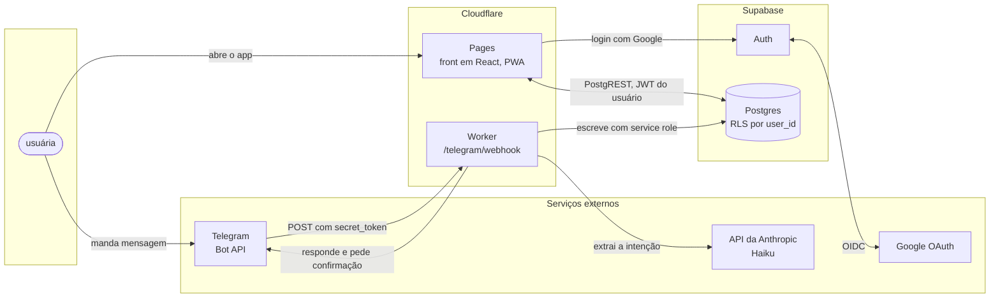

# Arquitetura

O Sobra tem duas portas de entrada (o app no navegador e o bot do Telegram) e um
único lugar onde o dado mora (o Postgres do Supabase). Nada de estado importante
vive no front, e nada de regra de negócio vive no bot.

## Visão geral



Sem mermaid, o mesmo desenho:

```
                        ┌──────────────────────────┐
   navegador  ────────► │ Cloudflare Pages (React) │ ──┐
   ou PWA               └──────────────────────────┘   │  JWT do usuário
                                   │ login              │  via PostgREST
                                   ▼                    │
                        ┌──────────────────────────┐    │
                        │ Supabase Auth  ◄──► Google│   │
                        └──────────────────────────┘    │
                                                        ▼
                                          ┌─────────────────────────┐
                                          │ Supabase Postgres       │
   Telegram  ──POST──►  ┌──────────────┐  │ RLS por user_id         │
   (secret_token)       │ CF Worker    │─►│ entries · installments  │
                        │ /webhook     │  │ incomes · debts · ...   │
                        └──────┬───────┘  └─────────────────────────┘
                               │ service role
                               ▼
                        ┌──────────────┐
                        │ API Anthropic│
                        │ (Haiku)      │
                        └──────────────┘
```

## O front (Cloudflare Pages)

React com Vite, publicado como site estático. Não existe servidor de aplicação.
O browser fala direto com o PostgREST do Supabase, carregando o JWT do usuário,
e o RLS no banco decide o que ele pode ler e escrever.

- **Sessão longa.** Login com Google uma vez, refresh token de longa duração.
  A ideia é nunca ver uma tela de login no dia a dia.
- **PWA.** Manifest, service worker e ícone da pasta `logo`. O uso principal é o
  celular na tela de início, mesmo com o desktop sendo o formato de projeto.
- **Cache.** As consultas de leitura ficam em cache local. Escrita otimista com
  rollback em caso de erro do servidor.

O front não recalcula regra de negócio. Ele lê views (`v_month_cashflow`,
`v_month_committed`, `v_debt_balances`, `v_reimbursements`) e desenha.

## O banco (Supabase)

Postgres com RLS ligado em todas as tabelas. Toda tabela tem `user_id` e toda
policy é `user_id = auth.uid()`. É um app de uma pessoa só, mas o RLS fica ligado
do mesmo jeito, porque é o que garante que um token vazado não vira leitura do
banco inteiro.

A regra central do modelo está no [SCHEMA](SCHEMA.md): **a compra parcelada nunca
é uma linha só**. Quem cria o lançamento é a função `create_entry_with_installments`,
que grava a `entry` e materializa as `installments` na mesma transação. Nenhum
cliente escreve em `installments` diretamente.

Recorrentes não têm fim, então são materializados num horizonte rolante de 12 meses.
Assim a tela de próximos meses lê linhas reais, não uma projeção calculada na hora.

Quem empurra esse horizonte é a função `sobra_extend_recurring`, chamada pelo
front no boot do app e pelo Worker antes de gravar. Não existe job agendado. A
manutenção fica amarrada ao uso: se o dado importa, é porque alguém abriu, e se
alguém abriu, ele acabou de ser estendido. Ver [ADR 0002](DECISIONS.md).

A função preenche a partir do último mês já gravado, não a partir de hoje. Ficar
meses sem abrir o app encurta o horizonte, mas não abre buraco no meio: na volta
ela preenche os meses que faltaram e recompõe os 12 à frente. Rodar duas vezes ou
rodar atrasada dá o mesmo resultado que rodar na hora certa.

**Cuidado na implementação:** a chamada precisa ser aguardada antes da primeira
leitura de dados no boot. Sem isso, uma volta depois de muito tempo renderiza a
tela com o horizonte ainda curto.

## O bot (Cloudflare Worker)

Um Worker único, com uma rota `POST /telegram/webhook`.

**Ordem das validações, antes de qualquer outra coisa:**

1. O header `X-Telegram-Bot-Api-Secret-Token` bate com `TELEGRAM_WEBHOOK_SECRET`.
   Se não bate, devolve 401 e não lê o corpo.
2. O `chat_id` da mensagem bate com `TELEGRAM_ALLOWED_CHAT_ID`. Se não bate,
   devolve 200 (para o Telegram parar de reenviar) e ignora.
3. Só então a mensagem é lida.

Depois disso o Worker chama a API da Anthropic com o modelo Haiku, passando o
texto do usuário e o contexto mínimo necessário (cartões, categorias, pessoas e
os previstos abertos do mês). A resposta volta como uma chamada de ferramenta
estruturada, nunca como texto livre para ser parseado.

**Regras fixas do prompt do bot:**

- Cartão padrão é o cartão azul.
- Nome de pessoa cadastrada em reembolso significa reembolso, nunca gasto dela.
- "previsto", "programado" e "vou gastar" criam status `previsto`.
- "pet", "gato" e "gatu" são todos a categoria pet.
- Nome de remédio e de consulta é saúde.
- Quando faltar informação, pergunta. Nunca chuta.

**O ciclo é sempre confirmar antes de gravar.** O bot responde com o que entendeu,
em português, com botões de confirmar e cancelar. Só depois do toque no botão a
escrita acontece. Para confirmar um previsto, ele procura entre os previstos
abertos do mês e, havendo ambiguidade, lista as opções com botão. Nenhum ID
aparece na conversa.

```
Usuária: mercado 82,40 no cartão azul
Bot:     Mercado, R$ 82,40, cartão azul, categoria mercado, hoje, confirmado.
       [ confirmar ]  [ mudar ]  [ cancelar ]
Usuária: (toca em confirmar)
Bot:     Lançado. Agosto está em R$ 5.915,85 confirmado.
```

O Worker escreve no Supabase com a service role key, que nunca sai do Worker e
nunca chega ao navegador. Como a service role passa por cima do RLS, o Worker
sempre grava com `user_id` fixado em `APP_USER_ID`.

## O que fica de fora do v1

Importar fatura em PDF ou foto de cupom. Isso exigiria um modelo com visão e
multiplicaria o custo por chamada, para resolver um problema que o lançamento
manual já resolve. Está registrado como [ADR 0007](DECISIONS.md).

## Segredos

| Variável | Onde vive |
| --- | --- |
| `VITE_SUPABASE_URL`, `VITE_SUPABASE_ANON_KEY` | build do Pages, públicas por natureza |
| `SUPABASE_SERVICE_ROLE_KEY` | secret do Worker, nunca no front |
| `TELEGRAM_BOT_TOKEN`, `TELEGRAM_WEBHOOK_SECRET` | secret do Worker |
| `TELEGRAM_ALLOWED_CHAT_ID`, `APP_USER_ID` | secret do Worker |
| `ANTHROPIC_API_KEY` | secret do Worker |

A lista completa, sem valores, está em [`.env.example`](../.env.example).
